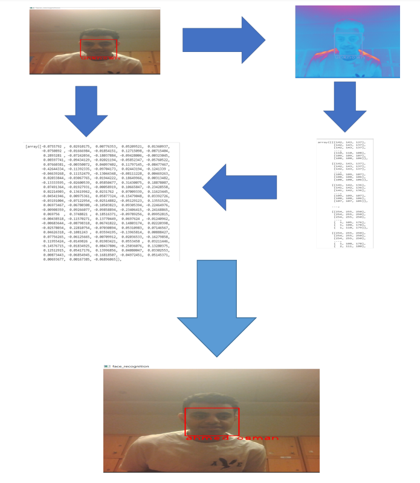
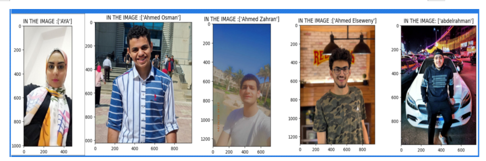

# Face_recognition-

## Abstract
A Face Recognition project utilizing linear algebra and the face recognition library involves the identification and verification of human faces in digital images or video. This technology relies on mathematical concepts from linear algebra to analyze and compare facial features.Linear algebra plays a crucial role in face recognition algorithms by representing facial images as high-dimensional vectors. These vectors capture essential facial attributes such as the positions and relationships of facial landmarks, color values, and texture information. By transforming images into numerical representations, linear algebra enables efficient computation and analysis of facial features.The face_recognition library is a popular open-source Python library that provides a simple interface for face recognition tasks. It utilizes deep learning models, including convolutional neural networks (CNNs), to extract meaningful facial features. These features are then compared against a database of known faces or used for facial identification.

## Introduction
Face recognition is a field of computer vision that involves identifying and verifying the identity of an individual from a digital image or video frame of their face. Linear algebra is a fundamental tool in this area, as it provides a mathematical framework for representing and manipulating image data. Face recognition systems are a major topic since there has been an increasing number of institutional, military, and commercial applications in recent years. Such systems must operate with extreme precision and accuracy in order to be dependable. A face recognition system's database is made up of pictures of the people the system must be able to identify. Whenever possible, the database should have multiple pictures of the same person. As opposed to the situation when only one image of each person is saved in the database, the problem can be solved more quickly if the photographs are chosen to account for various facial expressions, lighting situations, etc. The taken image is processed by a facial recognition algorithm, which then compares it to photographs in the database. If a match is discovered, the person is recognized. The person is reported as unidentified if no match is discovered. 
One important concept in face recognition is the use of eigenvectors and eigenvalues to represent images. The basic idea is to represent an image as a set of numerical values, where each value represents the intensity of a particular pixel in the image. These values can be organized into a matrix, known as the image matrix.
The image matrix can be decomposed into its eigenvectors and eigenvalues, which provide a way to represent the image in a compressed form. While the eigenvalues depict the degree of variation in each direction, the eigenvectors depict the directions in which the picture fluctuates most. By selecting a subset of the eigenvectors and eigenvalues.

## Literature Review

1- Stages Of Face Recognition System

2- Face detection

3- Face Analysis

4- Converting the image to data

5- Feature Extraction

6- Face Recognition and Matching

7- Face Verification

8-Face Detection Techniques

   a. Knowledge-Based
   
   b. Feature-Based
   
   c. Matching of Templates
   
   d. Appearance-Based
   
9-Life Applications of Face Recognition System

    a. Security
    
    b. Healthcare
    
    c. Retail
    
    d. Education
    
    e. Law enforcement
    
    f. Banking
    
    g. Airport

    
## methodology
The methodology of this research is focused on the use of Eigenfaces, a method for face recognition that uses linear algebra to represent and analyze the features of a human face. Face re	cognition technology is based on the idea that every person has a unique facial shape that can be analyzed and recognized by a computer system. The first step of this methodology is to collect a dataset of face images that will be used for training and testing the algorithm. The collected images are then preprocessed to remove any noise or inconsistencies that may hinder the accuracy of the recognition system.

Next, the Eigenfaces method is applied, which involves creating a set of eigenvectors from the dataset of face images. These eigenvectors represent the most significant features of the faces in the dataset, and they can be used to represent any face image as a linear combination of these eigenvectors. The algorithm then uses these eigenvectors to represent and compare the input face image with the dataset of known faces.

To implement the Eigenfaces method for face recognition, Suppose we have a dataset of face images represented as a matrix X, where each row of X represents an individual face image and each column represents a pixel in the image. We can preprocess the images, compute the mean face, and difference vectors as described in the methodology.
Next, we compute the covariance matrix of the difference vectors as follows:
1-C = 1/N * (X - M)' * (X - M)
where N is the number of face images in the dataset, X is the matrix of preprocessed face images, and M is the mean face.
We can then compute the eigenvectors and eigenvalues of C using eigendecomposition:
2-[V, D] = eig(C)
where V is a matrix of eigenvectors and D is a diagonal matrix of eigenvalues.
The eigenvectors in V represent the directions in which the faces in the dataset vary the most, while the corresponding eigenvalues in D represent the amount of variation along each eigenvector.
To select a subset of the eigenvectors that contain most of the significant facial features, we can sort the eigenvalues in descending order and select the first k eigenvectors with the highest eigenvalues.
Finally, to project a new face image onto the selected eigenvectors, we can compute the dot product of the difference vector of the new face image with each of the selected eigenvectors:
3-W = (X_new - M) * V(:, 1:k)
where X_new is the preprocessed new face image and W is a vector of weights that represent the new face image in the low-dimensional space defined by the selected eigenvectors.
To classify the new face image, we can compare its weight vector with the weight vectors of the known faces in the dataset using a distance metric such as Euclidean distance.

The Eigenfaces method is important in face recognition because it is a computationally efficient way of representing facial features in a low-dimensional space. This allows for fast and accurate matching of new faces against a database of known faces. The method is associated with linear algebra because it relies on techniques such as eigendecomposition and dot product, which are fundamental concepts in linear algebra. Other methods that can be used for face recognition include Local Binary Patterns, Principal Component Analysis, and Deep Learning-based methods. However, Eigenfaces remains a popular and effective method due to its simplicity and efficiency.

the eigenvectors are typically called eigenfaces due to their resemblance to real faces, as shown in this .
(Top 5 eigenfaces computed using the ORL database of faces  sorted from most variance (left) to least variance (right))
 New faces can be projected onto the subspace spanned by the eigenfaces to obtain the weights of the linear combination of eigenfaces needed to reconstruct them. This idea was used a lot to identify faces by comparing the weights of new faces to the weights of faces in a gallery set. A probabilistic version of this approach based on a Bayesian analysis of image differences we model two mutually exclusive classes of variation between two facial images: intra-personal (variations in appearance of the same individual, due to different expressions or lighting) and extra-personal (variations in appearance due to a difference in identity). In this method, two sets of eigenfaces were used to model intra-personal and interpersonal variations separately. Many other variations of the original eigenfaces method have been proposed. For example, a nonlinear extension of PCA based on kernel methods, namely kernel PCA , independent component analysis (ICA), a generalization of PCA that can capture high-order dependencies between pixels, and a two-dimensional PCA based on 2D image matrices instead of 1D vectors.
The Eigenfaces method has proven to be a successful approach for face recognition, with applications in various fields such as security systems, law enforcement, and access control. It is particularly beneficial because it can recognize faces regardless of the lighting, pose, and facial expression. The method's success is closely related to linear algebra, which provides the mathematical foundation for representing and manipulating the facial features of the input images.

## Results
The ghost faces appear to be sharper for some databases. For some others, they are blurry, as in this case. The backgrounds and other features of the photographs affect how sharp the images are.The database utilized for this project has 5 pictures of 1 person in it. 4 photos in all are used. The training set is used to compute the average face. Fig. (number of fig) displays a few photos from the training set.

In addition, part of 30% is in error because color images are not determined by the algorithm. Moreover, they were stationed in the middle of the light at the face.

Face recognition is a computer vision task that involves identifying and verifying the identity of a person based on their facial features. It is a common application of machine learning and computer vision algorithms. Linear algebra plays a crucial role in many aspects of face recognition. One important application of linear algebra in face recognition is in the computation of face embeddings. A face embedding is a high-dimensional vector that represents the features of a person's face. These embeddings are computed using deep neural networks, which involve many matrix computations, such as matrix multiplication, matrix inversion, and matrix factorization.
Once the embeddings are computed, linear algebra is also used to compare them and determine if two face images are of the same person or not. This is done using various distance metrics, such as Euclidean distance, cosine similarity, or Mahalanobis distance, which are all based on linear algebra concepts. Overall, linear algebra provides a mathematical foundation for many of the algorithms used in face recognition and is essential for understanding how these algorithms work and how to optimize their performance.

## conclusion

In conclusion, Face recognition technology is a field of computer vision that involves identifying and verifying the identity of an individual from a digital image or video frame of their face. It utilizes artificial intelligence to compare and identify individuals by analyzing and contrasting photos of human faces with a database of recognized faces. The three main components of this research project will be studied, with a focus on the eigenvector method for feature extraction. The report will also analyze the limitations of the face databases commonly used to evaluate these algorithms, which may impact the accuracy and reliability of the technology. Facial recognition technology uses eigenvectors and eigenvalues to represent images.

